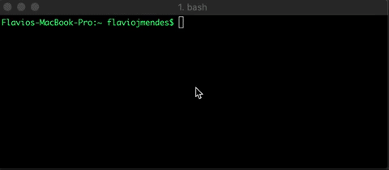

### Triangle Determiner
[](https://travis-ci.org/flaviojmendes/triangle-determiner)
[](https://codecov.io/gh/flaviojmendes/triangle-determiner)


This is a simple application that determines the type of a triangle by its sides length.

#### Explanation

By Math, according to its sides length a Triangle can be categorized into: 

- **Equilateral:** all sides have the same length.
- **Isosceles:** has two sides of equal length.
- **Scalene:** has all its sides of different lengths.

#### How to Run?

##### Building on your own

This project  uses Go modules, therefore it depends on Go 1.11 and newer. 
Also, it means it doesn't necessarily have to be contained inside your $GOPATH/src folder. 
Once you've cloned the repo locally, you may run `go mod verify` to make sure all dependencies are present.

After that you should run `go build` and then:

```
$ ./triangle-determiner {A} {B} {C}

-- FOR EXAMPLE --

$ ./triangle-determiner 3 3 3

-- WILL RETURN --

2019/01/07 21:39:00 The type of the Triangle is Equilateral

```

##### Getting from DockerHub

This project is fully integrated and being deployed at DockerHub.
So, assuming you have Docker installed, to use it you just have to execute the following:

```
$ docker run -i flaviojmendes/triangle-determiner {A} {B} {C}

-- FOR EXAMPLE --

$ docker run -i flaviojmendes/triangle-determiner 3 3 3

-- WILL RETURN --

2019/01/07 21:39:00 The type of the Triangle is Equilateral

```




###### References

[Wikipedia - Triangle Inequality](https://en.wikipedia.org/wiki/Triangle_inequality)
